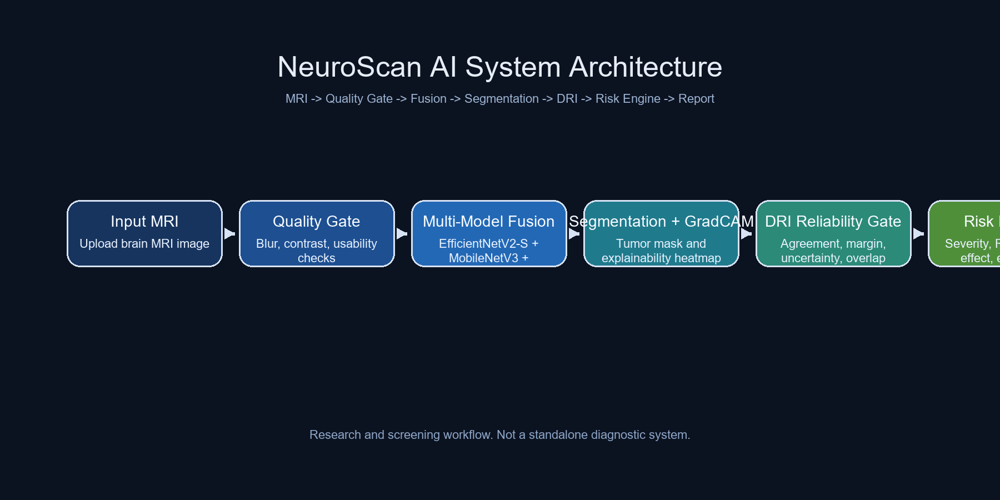

<div align="center">

# NeuroScan AI

### Brain MRI Screening, Explainability, Reliability Gating, and Automated Reporting


Research-focused MRI analysis system that combines multi-model tumor classification, lesion-aware fusion, segmentation, Grad-CAM explainability, diagnostic reliability scoring, Groq-based report generation, and PDF export in one FastAPI workflow.

</div>

> Important: This repository is built for research, screening, demonstrations, and workflow support. It is not a standalone clinical diagnosis system.

## Table of Contents

- [Overview](#overview)
- [Why This Project Stands Out](#why-this-project-stands-out)
- [System Preview](#system-preview)
- [Pipeline](#pipeline)
- [Model Stack](#model-stack)
- [Results Gallery](#results-gallery)
- [Repository Structure](#repository-structure)
- [Core Modules](#core-modules)
- [Setup](#setup)
- [Testing](#testing)
- [Strengths and Limitations](#strengths-and-limitations)
- [Clinical Safety Note](#clinical-safety-note)

## Overview

NeuroScan AI is designed as a full MRI analysis workflow rather than a basic classifier demo. The app validates scan quality, classifies the scan with three models, refines confidence with lesion-aware fusion, segments the lesion, compares Grad-CAM evidence with the segmentation mask, estimates morphology and risk, applies a Diagnostic Reliability Index (DRI) gate, generates an imaging summary with Groq, and exports a PDF report.

The current FastAPI interface includes:

- `/` for MRI upload and full analysis
- `/api/history` for previously processed cases
- `/api/model-info` for model and imaging metadata

## Why This Project Stands Out

- `Closed-loop design`: classification is not treated as the final step; segmentation and overlap signals feed back into confidence and reliability.
- `Lesion-aware fusion`: the ensemble is adjusted using scan quality, certainty, morphology, and explainability-derived trust.
- `Reliability gating`: the repo includes a DRI-based acceptance layer instead of only returning a prediction.
- `Reporting workflow`: results are turned into structured imaging text and downloadable PDF reports.
- `Presentation-ready assets`: training curves, confusion matrices, classification reports, and architecture visuals are already included.

## System Preview



## Pipeline

```text
Input MRI
  ->
Scan quality validation
  ->
3-model classification
  ->
Adaptive lesion-aware fusion
  ->
Tumor segmentation
  ->
Grad-CAM heatmap generation
  ->
Tumor size + morphology analysis
  ->
Overlap consistency + DRI gate
  ->
Risk and urgency support
  ->
Groq imaging summary
  ->
PDF report export
```

## Feature Summary

| Area | Capability |
|---|---|
| Classification | Predicts `glioma`, `meningioma`, `pituitary`, or `no_tumor` |
| Fusion | Uses adaptive weighting based on confidence, entropy, quality, and lesion trust |
| Segmentation | Produces a binary tumor mask for lesion localization |
| Explainability | Generates Grad-CAM heatmaps for visual reasoning support |
| Morphology | Estimates area, diameter, volume, irregularity, convexity, and mass effect |
| Reliability | Computes DRI score, tier, escalation reasons, and gate decision |
| Risk Support | Produces severity, progression risk, urgency, and clinical steps |
| Reporting | Builds structured AI summaries and PDF reports |
| History | Saves prior cases and compares progression where available |

## Model Stack

| Model | Role | Input Size |
|---|---|---:|
| EfficientNetV2-S | primary classifier | 384 x 384 |
| MobileNetV3 | ensemble classifier | 384 x 384 |
| ConvNeXt Tiny | ensemble classifier | 384 x 384 |
| EfficientNet-based U-Net | segmentation model | 256 x 256 |

Classification targets:

- `glioma`
- `meningioma`
- `no_tumor`
- `pituitary`

## Results Gallery

The repository includes visual results in [`docs/`](/D:/Brain%20Tumor%20Detection%20%26%20Analysis/Code/docs). For a cleaner project presentation, this README highlights the primary classifier results from EfficientNetV2-S only.

### Architecture


### EfficientNetV2-S Highlights


## Repository Structure

```text
Code/
|-- app/           FastAPI interface and workflow orchestration
|-- core/          fusion, segmentation, explainability, morphology, risk, reliability
|-- reporting/     LLM report generation and PDF export
|-- utils/         config, history, and I/O helpers
|-- training/      model training scripts
|-- experiments/   notebooks for validation and benchmarking
|-- tests/         pytest checks
|-- deploy/        deployment utilities
|-- docs/          architecture diagram and result images
|-- sample_data/   repository-local sample assets
|-- requirements.txt
`-- README.md
```

## Core Modules

- [`app/main.py`](app/main.py): FastAPI routes and upload page
- [`app/pipeline.py`](app/pipeline.py): end-to-end MRI analysis workflow
- [`core/classifier_fusion.py`](/D:/Brain%20Tumor%20Detection%20%26%20Analysis/Code/core/classifier_fusion.py): multi-model prediction, adaptive fusion, lesion trust
- [`core/segmentation.py`](/D:/Brain%20Tumor%20Detection%20%26%20Analysis/Code/core/segmentation.py): segmentation inference and mask generation
- [`core/diagnostic_reliability.py`](/D:/Brain%20Tumor%20Detection%20%26%20Analysis/Code/core/diagnostic_reliability.py): DRI scoring, tiering, and escalation logic
- [`core/risk_engine.py`](/D:/Brain%20Tumor%20Detection%20%26%20Analysis/Code/core/risk_engine.py): severity, urgency, progression, and decision support
- [`reporting/llm_report_generator.py`](/D:/Brain%20Tumor%20Detection%20%26%20Analysis/Code/reporting/llm_report_generator.py): Groq-based imaging summary generation
- [`reporting/pdf_report_generator.py`](/D:/Brain%20Tumor%20Detection%20%26%20Analysis/Code/reporting/pdf_report_generator.py): report visualization and PDF export
- [`utils/config.py`](/D:/Brain%20Tumor%20Detection%20%26%20Analysis/Code/utils/config.py): paths, constants, and model loading
- [`utils/history_manager.py`](/D:/Brain%20Tumor%20Detection%20%26%20Analysis/Code/utils/history_manager.py): local history persistence and prior-case comparison

## Setup

### 1. Create and activate a virtual environment

```bash
python -m venv .venv
.venv\Scripts\activate
```

Use Python 3.10, 3.11, or 3.12 for TensorFlow 2.16. Python 3.14 is not supported by the pinned TensorFlow build.

### 2. Install dependencies

```bash
python -m pip install -r requirements.txt
```

Main packages include TensorFlow, FastAPI, Uvicorn, OpenCV, NumPy, pandas, Pillow, fpdf2, Groq, matplotlib, requests, and pytest.

### 3. Configure secrets

The project uses `.env` in the repository root for local secrets.

Create `.env` with:

```env
GROQ_API_KEY=your_key_here
```

Use [`.env.example`](/D:/Brain%20Tumor%20Detection%20%26%20Analysis/Code/.env.example) as the safe template. The config also keeps legacy support for `env.txt`, but `.env` is now the standard format.

### 4. Prepare project directories

For full functionality, the project expects these folders in the repository root:

```text
NeuroScan-AI/
|-- MODEL/
|-- Reports/
|-- History/
`-- Test Data/
```

Folder purposes:

- `MODEL/` stores trained `.keras` weights. Download them from [Hugging Face](https://huggingface.co/tharunsridhar/brain_tumor_net-ensemble/tree/main/models), then place the files in `MODEL/`.
- `Reports/` stores generated PDF reports
- `History/` stores saved case history
- `Test Data/` stores sample MRI images for the app selector

### 5. Run the app

```bash
uvicorn app.main:app --reload
```

Open <http://127.0.0.1:8000> in your browser.

For the already-created Windows virtual environment, prefer:

```powershell
.\.venv\Scripts\python.exe -m uvicorn app.main:app --host 127.0.0.1 --port 8000
```

## FastAPI Endpoints

- `GET /health`: service health
- `GET /ready`: model-file readiness check
- `POST /api/analyze`: upload MRI image and receive JSON analysis plus PDF URL
- `GET /api/history`: local analyzed-case history
- `GET /api/reports`: generated PDF report list
- `GET /api/reports/{filename}`: download one PDF report
- `GET /api/model-info`: model classes, input sizes, MRI metadata, and model file paths
- `GET /docs`: interactive Swagger documentation

## Deployment

Windows local service:

```powershell
.\deploy\start.ps1 -HostName 127.0.0.1 -Port 8000
```

Docker:

```bash
docker compose -f deploy/docker-compose.yml up --build
```

Deployment details are in [`deploy/README.md`](deploy/README.md).

## Testing

The repo currently includes lightweight tests for:

- quality metrics
- adaptive fusion
- diagnostic reliability gating
- segmentation mask output validation

Run them with:

```bash
pytest
```

## Strengths and Limitations

### Strengths

- modular codebase with clear separation between app, core logic, utilities, reporting, and tests
- code-aware reliability layer that goes beyond plain classification confidence
- built-in visual assets that help with demos, portfolio posts, and presentations
- report generation pipeline that makes the project feel end-to-end
- prior-case comparison support through local history tracking

### Limitations

- trained model files are external and not bundled in this repository. Download them from [Hugging Face](https://huggingface.co/tharunsridhar/brain_tumor_net-ensemble/tree/main/models).
- Groq-based reporting requires a valid `GROQ_API_KEY`
- test coverage is useful but still lightweight
- the project is suited to research and demonstration rather than direct clinical deployment

## Clinical Safety Note

All outputs should be treated as decision support only. Final diagnosis, tumor grading, treatment planning, and case interpretation must be confirmed by qualified clinicians and, when appropriate, histopathology.
