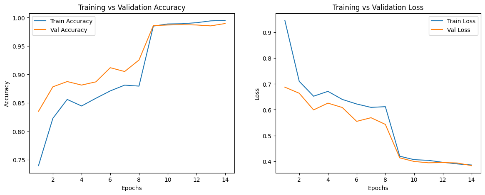

# 🧠 NeuroScan AI — Brain Tumor MRI Analysis System

> **Research & screening tool. Not intended for clinical diagnosis.**

NeuroScan AI is a full-stack deep learning pipeline for brain MRI analysis. It combines a 3-model classification ensemble, EfficientNet U-Net segmentation, Grad-CAM explainability, and Groq Llama-4 radiology report generation — all wrapped in a Streamlit interface deployed via Google Colab + ngrok.

---

## Pipeline Overview
```
Upload MRI
    │
    ▼
Step 0 │ Scan Quality Validation
    │
    ▼
Step 1 │ Classification (EfficientNetV2-S · MobileNetV3 · ConvNeXt-Tiny)
    │         ↓ raw probabilities
    │   First-pass fusion ──► No Tumor? ──► Normal Report Path
    │         ↓ Tumor detected
    ▼
Step 2 │ EfficientNetB4 Attention U-Net Segmentation  (BRISC 2025, Dice ~0.88)
    │
    ▼
Step 3 │ Grad-CAM Explainability (EfficientNetV2-S backbone)
    │
    ▼
Step 4 │ Lesion Metrics  →  Size · Shape · Mass Effect · XAI Overlap
    │
    ▼
Step 5 │ Lesion-Aware Second-Pass Fusion (closed-loop, dynamic weighting)
    │
    ▼
Step 6 │ Risk Scoring · DRI · RANO Assessment · Prior-Case Comparison
         Groq Llama-4 Radiology Report Generation
    │
    ▼
Step 7 │ PDF Export
         ├── Tumor  → 3-page report
         └── Normal → 2-page report
```

---

## Classification Models

| Model | Input Size | Role |
|---|---|---|
| EfficientNetV2-S | 384 × 384 | Primary — highest weight in fusion |
| MobileNetV3 | 384 × 384 | Secondary ensemble member |
| ConvNeXt-Tiny | 384 × 384 | Secondary ensemble member |

Fusion uses **case-specific dynamic weighting** adjusted by scan quality and lesion context (area, diameter, irregularity, XAI overlap score).

**Manual test results** on 4 held-out images:

| True Label | EfficientNetV2-S | MobileNetV3 | ConvNeXt-Tiny |
|---|---|---|---|
| Glioma | ✅ 0.9657 | ✅ 0.7437 | ✅ 0.4528 |
| Meningioma | ✅ 0.8944 | ✅ 0.8019 | ✅ 0.5716 |
| Pituitary | ✅ 0.8575 | ✅ 0.7357 | ✅ 0.4762 |
| No Tumor | ✅ 0.9217 | ✅ 0.9156 | ✅ 0.9349 |

---
## Training Graphs

**EfficientNetV2-S — Classification**



**EfficientNetB4 Attention U-Net — Segmentation**


---

## Segmentation Model

| Detail | Value |
|---|---|
| Architecture | EfficientNetB4 Attention U-Net |
| Dataset | BRISC 2025 |
| Test Dice Score | ~0.88 |
| File | `brisc_effunet.keras` |

---

## Diagnostic Reliability Index (DRI)

The DRI is a composite score computed from 7 signals:

- Scan quality
- Model agreement
- Fused confidence
- Class margin
- XAI consistency (Grad-CAM ↔ segmentation overlap)
- Risk (inverted)
- Lesion trust multiplier

Results are tiered as **HIGH / MODERATE / LOW** with auto-escalation flags surfaced in the UI.

---

## Repository Structure
```
Brain-Tumor-MRI-AI-Analysis-System/
├── app.py                          # Streamlit UI + model loading
├── features.py                     # All analysis logic
├── deployment.py                   # Colab + ngrok launcher
├── config.py                       # Paths, keys, constants
├── requirements.txt
├── models/
│   └── README.md                   # Model download instructions
├── notebooks/
│   ├── data_cleaning/
│   │   ├── classification_dataset_checking.ipynb
│   │   ├── segmentation_data_check.ipynb
│   │   └── segmentation_dataset_cleaning.ipynb
│   ├── classification_training/
│   │   ├── efficientnetv2s_training.ipynb
│   │   ├── mobilenetv3_training.ipynb
│   │   └── convnext_tiny_training.ipynb
│   ├── segmentation_training/
│   │   └── segmentation_model_training.ipynb
│   ├── testing_and_validation/
│   │   └── classification_testing.ipynb
│   └── deployment_prototype/
│       └── final_deployment_notebook.ipynb
├── sample_data/
│   ├── test_glioma.jpg
│   ├── test_meningioma.jpg
│   ├── test_pituitary.jpg
│   └── test_no_tumor.jpg
├── docs/
│   ├── confusion_matrices/
│   ├── graphs/
│   ├── screenshots/
│   ├── sample_outputs/
│   ├── architecture.md
│   ├── dataset.md
│   ├── results.md
│   └── setup.md
└── tests/
```

---

## Setup & Deployment

Full setup instructions are in [`docs/setup.md`](docs/setup.md). Quick start below.

### 1. Mount Google Drive and place models
```
MyDrive/Project work/models/
├── Classification/
│   ├── Tumor_v2s_clean.keras
│   ├── class_Tumor_mobilenet_v3.keras
│   └── class_Tumor_convnext_tiny_tumor.keras
└── new Segmentation/
    └── brisc_effunet.keras
```

### 2. Set your Groq API key

In Google Colab, add a secret named `GROQ_API_KEY`:
```python
from google.colab import userdata
GROQ_API_KEY = userdata.get("GROQ_API_KEY")
```

**Never hardcode API keys in notebooks.**

### 3. Install dependencies
```bash
pip install -r requirements.txt
```

### 4. Run via deployment notebook

Open `notebooks/deployment_prototype/final_deployment_notebook.ipynb` in Colab and run all cells. The ngrok URL will appear in the output.

---

## Requirements
```
tensorflow>=2.15
streamlit
opencv-python
Pillow
numpy
pandas
fpdf2
groq
pyngrok
```

Full list in `requirements.txt`.

---

## Features at a Glance

| Feature | Details |
|---|---|
| Classification | 3-model ensemble, weighted fusion |
| Segmentation | EfficientNetB4 Attention U-Net, Dice ~0.88 |
| Explainability | Grad-CAM on EfficientNetV2-S backbone |
| Tumor Metrics | Area (cm²), diameter (cm), volume (cm³), bounding box |
| Shape Analysis | Irregularity, solidity, aspect ratio |
| Mass Effect | Midline shift detection |
| XAI Overlap | Heatmap ↔ mask consistency score |
| DRI | 7-component diagnostic reliability index |
| Escalation Gate | Auto-rejection / uncertainty flagging |
| Prior Comparison | Area change tracking across sessions |
| LLM Report | Groq Llama-4 radiology narrative |
| PDF Export | 3-page tumor report / 2-page normal report |
| History Dashboard | Per-session case log with DRI and lesion trust |

---

## Classes

`glioma` · `meningioma` · `pituitary` · `no_tumor`

---

## Author

**Tharun Sridhar Natarajan**  
B.Tech Computer Science — VIT Vellore  
[github.com/tharunsridhar](https://github.com/tharunsridhar)

---

## Disclaimer

This system is built for academic research and screening demonstrations only. It is **not validated for clinical use** and must not be used as a substitute for professional medical diagnosis.
